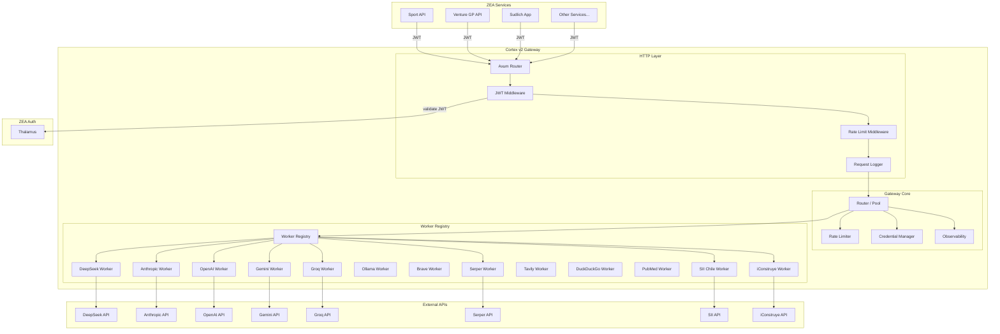
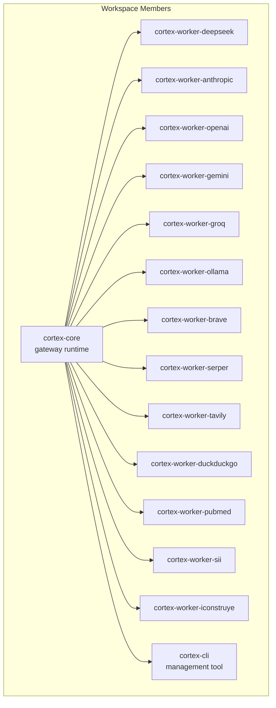
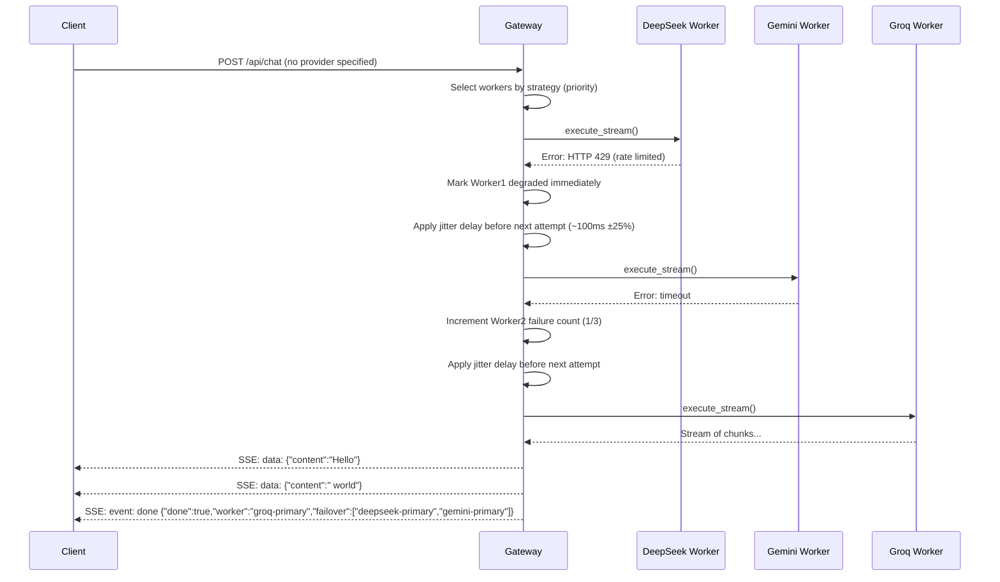
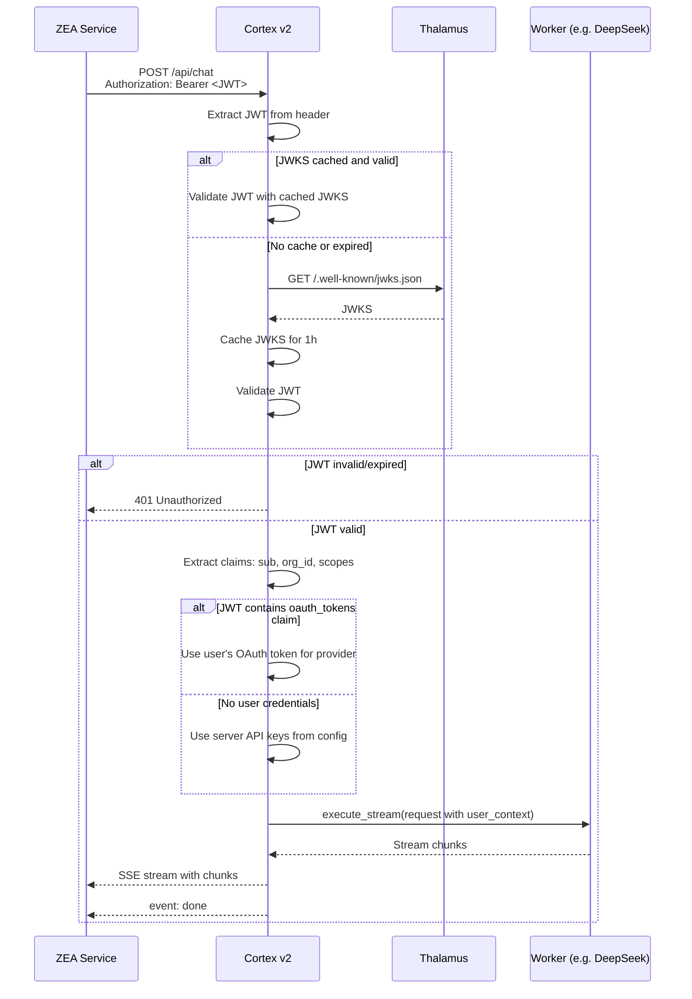
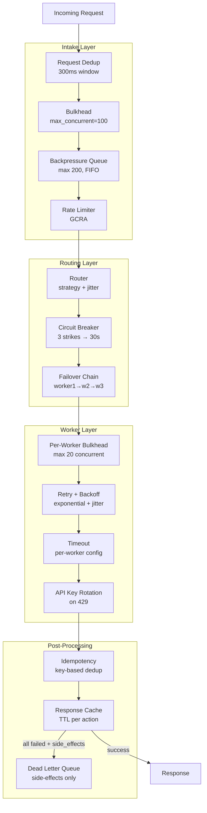

# Design Document — Cortex v2 Universal Service Gateway

## Overview

Cortex v2 is a universal service gateway implemented in Rust, designed as a Cargo workspace with a thin core and independent worker crates. The architecture follows a layered model: the **HTTP layer** (axum) receives requests and validates JWTs against Thalamus; the **Gateway Core** routes requests through configurable strategies, applies rate limiting, and manages failover; the **Worker Registry** holds dynamically loaded workers, each implementing the `Worker` trait. Workers are compiled statically — dynamic loading (`.so`/`.dylib`) is explicitly avoided in favor of compile-time safety and zero-cost abstractions.

### Key Design Decisions

1. **Cargo workspace with independent crates**: Each worker is a separate crate with its own `Cargo.toml`, versioning, and dependencies. Adding a worker means adding a crate + a config block. No gateway core changes.
2. **`async_trait` for Worker abstraction**: Rust's native async traits are still evolving (RFC 3425). `async_trait` macro provides stable, ergonomic async trait methods with Send + Sync bounds required for axum's task spawning.
3. **Axum + Tokio**: Axum provides type-safe request extraction, middleware layering, and native WebSocket support. Tokio is the de-facto async runtime with the richest ecosystem.
4. **`reqwest` for HTTP client**: Native async, connection pooling, streaming bodies, TLS via `rustls`. Single client shared across all workers with per-worker timeout overrides.
5. **GCRA rate limiting via `governor`**: Generic Cell Rate Algorithm provides fair burst handling without the memory overhead of sliding window counters.
6. **Static binary via `musl`**: Single binary deployable in `scratch` Docker. No glibc dependency, no dynamic linking issues.
7. **No database required for core**: Worker configuration comes from TOML files and env vars. Optional PostgreSQL for audit logging can be enabled. This keeps the core dependency-free.
8. **Thalamus JWKS caching**: Public keys cached in memory with TTL, refreshed on 401 responses. No external cache dependency.

---

## Architecture

### High-Level System Architecture



### Crate Dependency Graph



> Arrows point FROM dependency TO dependent. `cortex-core` is the library that all workers and the CLI depend on. The main binary `cortex-gateway` depends on core + all workers (statically linked).

---

## Crate Structure

```
cortex-v2/
├── Cargo.toml              # Workspace root
├── Cargo.lock
├── cortex.toml             # Default config
├── Dockerfile
├── README.md
│
├── crates/
│   ├── cortex-core/        # Gateway runtime library
│   │   ├── Cargo.toml
│   │   └── src/
│   │       ├── lib.rs
│   │       ├── worker.rs           # Worker trait definition
│   │       ├── registry.rs         # Worker registration & lookup
│   │       ├── router.rs           # Pool, strategies, failover
│   │       ├── rate_limiter.rs     # GCRA rate limiter
│   │       ├── credentials.rs      # API key manager & rotation
│   │       ├── observability.rs    # Metrics, tracing, logs
│   │       ├── auth.rs             # JWT validation, Thalamus client
│   │       └── config.rs           # TOML config parsing
│   │
│   ├── cortex-gateway/      # Main binary
│   │   ├── Cargo.toml
│   │   └── src/
│   │       ├── main.rs
│   │       ├── server.rs           # Axum app setup
│   │       ├── routes/
│   │       │   ├── mod.rs
│   │       │   ├── chat.rs         # /api/chat, /v1/chat/completions
│   │       │   ├── search.rs       # /api/search
│   │       │   ├── services.rs     # /api/services/{type}
│   │       │   ├── models.rs       # /api/models, /v1/models
│   │       │   ├── health.rs       # /api/health, /api/health/detailed
│   │       │   └── stats.rs        # /api/stats, /metrics
│   │       └── middleware/
│   │           ├── mod.rs
│   │           ├── auth.rs         # JWT extraction & validation
│   │           └── request_id.rs   # X-Request-Id propagation
│   │
│   ├── cortex-cli/          # CLI management tool
│   │   ├── Cargo.toml
│   │   └── src/
│   │       └── main.rs
│   │
│   └── workers/
│       ├── deepseek/
│       │   ├── Cargo.toml
│       │   └── src/lib.rs
│       ├── anthropic/
│       │   ├── Cargo.toml
│       │   └── src/lib.rs
│       ├── openai/
│       │   ├── Cargo.toml
│       │   └── src/lib.rs
│       ├── gemini/
│       │   ├── Cargo.toml
│       │   └── src/lib.rs
│       ├── groq/
│       │   ├── Cargo.toml
│       │   └── src/lib.rs
│       ├── ollama/
│       │   ├── Cargo.toml
│       │   └── src/lib.rs
│       ├── brave/
│       ├── serper/
│       ├── tavily/
│       ├── duckduckgo/
│       ├── pubmed/
│       ├── sii/
│       │   ├── Cargo.toml
│       │   └── src/
│       │       ├── lib.rs
│       │       ├── client.rs       # HTTP client for SII API
│       │       └── parser.rs       # HTML→JSON parser for SII responses
│       └── iconstruye/
│           ├── Cargo.toml
│           └── src/
│               ├── lib.rs
│               ├── client.rs
│               └── auth.rs         # Session management for iConstruye
```

---

## Worker Trait — Core Abstraction

This is the central design element. Every worker implements this trait. The gateway core only knows about this trait — never about specific worker types.

```rust
// crates/cortex-core/src/worker.rs

use async_trait::async_trait;
use futures::stream::BoxStream;
use serde::{Deserialize, Serialize};
use std::collections::HashMap;

/// Unified request envelope for any service type.
#[derive(Debug, Clone, Serialize, Deserialize)]
pub struct ServiceRequest {
    /// Service-specific action (e.g., "chat", "consultar_rut", "buscar_proveedores")
    pub action: String,

    /// Request payload — worker interprets based on action
    pub payload: serde_json::Value,

    /// Optional parameters (model, temperature, max_results, etc.)
    pub params: HashMap<String, String>,

    /// User context from Thalamus JWT
    pub user_context: UserContext,
}

/// User identity and credentials from Thalamus JWT.
#[derive(Debug, Clone, Serialize, Deserialize)]
pub struct UserContext {
    pub sub: String,
    pub org_id: Option<String>,
    pub scopes: Vec<String>,
    /// OAuth tokens for user-owned provider credentials
    pub oauth_tokens: HashMap<String, OAuthToken>,
}

#[derive(Debug, Clone, Serialize, Deserialize)]
pub struct OAuthToken {
    pub access_token: String,
    pub refresh_token: Option<String>,
    pub expires_at: Option<i64>,
}

/// Unified response from any worker.
#[derive(Debug, Clone, Serialize, Deserialize)]
pub struct ServiceResponse {
    /// Structured response data
    pub data: serde_json::Value,

    /// Worker that handled the request
    pub worker: String,

    /// Model or endpoint used (if applicable)
    pub model: Option<String>,

    /// Token usage (for LLM workers)
    pub usage: Option<UsageInfo>,
}

#[derive(Debug, Clone, Serialize, Deserialize)]
pub struct UsageInfo {
    pub prompt_tokens: u64,
    pub completion_tokens: u64,
    pub total_tokens: u64,
}

/// A chunk in a streaming response.
#[derive(Debug, Clone, Serialize, Deserialize)]
pub struct StreamChunk {
    pub content: String,
    pub finish_reason: Option<String>,
}

/// Worker health status.
#[derive(Debug, Clone, Serialize, Deserialize, PartialEq)]
pub enum HealthStatus {
    Healthy,
    Degraded { reason: String },
    Unavailable { reason: String },
}

/// Error types for worker operations.
#[derive(Debug, thiserror::Error)]
pub enum WorkerError {
    #[error("HTTP {status}: {message}")]
    HttpError { status: u16, message: String },

    #[error("Rate limited: {0}")]
    RateLimited(String),

    #[error("Authentication failed: {0}")]
    AuthFailed(String),

    #[error("Timeout after {0}ms")]
    Timeout(u64),

    #[error("Configuration error: {0}")]
    ConfigError(String),

    #[error("Parse error: {0}")]
    ParseError(String),

    #[error(transparent)]
    Other(#[from] anyhow::Error),
}

/// The universal worker trait — every service adapter implements this.
#[async_trait]
pub trait Worker: Send + Sync {
    /// Unique worker name (e.g., "deepseek-primary")
    fn name(&self) -> &str;

    /// Service type category: "llm", "search", "tax", "erp", etc.
    fn service_type(&self) -> &str;

    /// Declared capabilities: ["chat", "tools", "streaming", "consultar_rut", ...]
    fn capabilities(&self) -> Vec<&str>;

    /// Priority: lower = higher priority for auto-selection
    fn priority(&self) -> u8;

    /// Synchronous (non-streaming) execution
    async fn execute(
        &self,
        request: ServiceRequest,
    ) -> Result<ServiceResponse, WorkerError>;

    /// Streaming execution. Default: buffers execute() and emits as single chunk.
    async fn execute_stream(
        &self,
        request: ServiceRequest,
    ) -> Result<BoxStream<'static, Result<StreamChunk, WorkerError>>, WorkerError> {
        let response = self.execute(request).await?;
        let content = response.data.to_string();
        let stream = futures::stream::once(async move {
            Ok(StreamChunk {
                content,
                finish_reason: Some("stop".into()),
            })
        });
        Ok(Box::pin(stream))
    }

    /// Health check — called periodically by the router
    async fn health_check(&self) -> Result<HealthStatus, WorkerError>;

    /// API keys configured for this worker (if applicable)
    fn api_keys(&self) -> &[String];

    /// Rotate to the next API key
    fn rotate_api_key(&mut self);

    /// Worker metadata for health endpoints
    fn metadata(&self) -> WorkerMetadata {
        WorkerMetadata {
            name: self.name().to_string(),
            service_type: self.service_type().to_string(),
            capabilities: self.capabilities().iter().map(|s| s.to_string()).collect(),
            priority: self.priority(),
            api_keys_count: self.api_keys().len(),
        }
    }
}

#[derive(Debug, Clone, Serialize, Deserialize)]
pub struct WorkerMetadata {
    pub name: String,
    pub service_type: String,
    pub capabilities: Vec<String>,
    pub priority: u8,
    pub api_keys_count: usize,
}
```

---

## Router / Pool Design

The router maintains a registry of workers and selects which worker handles each request.

```rust
// crates/cortex-core/src/router.rs (simplified)

pub struct Router {
    workers: HashMap<String, Box<dyn Worker>>,
    failure_counts: HashMap<String, u32>,
    degraded_until: HashMap<String, Instant>,
    strategy: SelectionStrategy,
    rate_limiter: RateLimiter,
    concurrent_requests: Arc<Semaphore>,  // Bulkhead: max concurrent in-flight requests
    jitter_rng: Mutex<ChaCha8Rng>,        // Jitter for recovery delays
}

pub enum SelectionStrategy {
    Priority,     // Default: sort by priority(), lowest first
    RoundRobin {  // Rotate through workers
        index: AtomicU64,
    },
    LeastUsed {   // Track usage counts
        usage: HashMap<String, AtomicU64>,
    },
}

impl Router {
    /// Route a request with failover
    pub async fn route(
        &mut self,
        service_type: &str,
        preferred_provider: Option<&str>,
        request: ServiceRequest,
    ) -> Result<ServiceResponse, RouterError> {
        // 1. If preferred_provider, try it first, no failover
        // 2. Otherwise, apply strategy, iterate workers, failover on error
        // 3. Track failure counts, degrade workers at 3 strikes
        // 4. Rate limit check before each worker attempt
    }

    /// Route a streaming request with failover
    pub async fn route_stream(
        &mut self,
        service_type: &str,
        preferred_provider: Option<&str>,
        request: ServiceRequest,
    ) -> Result<BoxStream<'static, Result<StreamChunk, WorkerError>>, RouterError> {
        // Same as route() but calls worker.execute_stream()
        // On stream failure, attempts failover to next worker
        // Resends full request to next worker on mid-stream failure
    }
}
```

### Failover Flow



---

## Configuration Format

```toml
# cortex.toml

[gateway]
host = "0.0.0.0"
port = 4000
global_rate_limit_rpm = 1000
log_level = "info"          # debug, info, warn, error
log_format = "json"         # json, text

[thalamus]
jwks_url = "https://thalamus.zea.localhost/.well-known/jwks.json"
jwks_cache_ttl_secs = 3600
required_scope = "cortex:use"

[observability]
prometheus_enabled = true
prometheus_port = 9090
otel_enabled = false
otel_endpoint = "http://localhost:4317"

[cache]
enabled = true
max_entries = 10000
default_ttl_secs = 300            # 5 min default

[dead_letter_queue]
enabled = true
storage = "sqlite"                # sqlite or postgres
path = "/var/lib/cortex/dlq.db"
max_retries = 5
retry_backoff_base_secs = 60

[connection_pool]
max_idle_per_host = 10
pool_max_idle_timeout = 90
pool_max_size = 50
tcp_keepalive = 60
connect_timeout = 10

[dedup]
enabled = true
window_ms = 300

[router]
strategy = "priority"       # priority, round_robin, least_used
failover_enabled = true
degradation_threshold = 3
degradation_ttl_secs = 30
max_concurrent_requests = 100         # Bulkhead: reject requests above this limit
max_concurrent_per_worker = 20        # Bulkhead: per-worker concurrency cap
jitter_pct = 25                       # Jitter: ±25% on retry/recovery delays
request_timeout_secs = 30             # Global request timeout (overrides worker timeouts)
backpressure_queue_size = 200         # Max requests queued before returning 503
backpressure_enabled = true

# ── LLM Workers ──────────────────────────────────────

[workers.deepseek]
enabled = true
service_type = "llm"
api_keys = ["${DEEPSEEK_API_KEY}"]
default_model = "deepseek-chat"
timeout_secs = 60
priority = 10
capabilities = ["chat", "tools", "streaming", "reasoning"]
base_url = "https://api.deepseek.com"

[workers.anthropic]
enabled = true
service_type = "llm"
api_keys = ["${ANTHROPIC_API_KEY}"]
default_model = "claude-sonnet-4-20250514"
timeout_secs = 60
priority = 20
capabilities = ["chat", "tools", "streaming", "reasoning", "long_context"]

[workers.openai]
enabled = true
service_type = "llm"
api_keys = ["${OPENAI_API_KEY}"]
default_model = "gpt-4o"
timeout_secs = 60
priority = 30
capabilities = ["chat", "tools", "streaming", "vision"]

[workers.gemini]
enabled = true
service_type = "llm"
api_keys = ["${GEMINI_API_KEY}"]
default_model = "gemini-2.5-flash"
timeout_secs = 60
priority = 25
capabilities = ["chat", "tools", "streaming", "vision", "long_context"]

[workers.groq]
enabled = true
service_type = "llm"
api_keys = ["${GROQ_API_KEY}"]
default_model = "llama-3.3-70b-versatile"
timeout_secs = 30
priority = 15
capabilities = ["chat", "tools", "streaming", "fast"]

[workers.ollama]
enabled = false
service_type = "llm"
base_url = "http://localhost:11434"
default_model = "llama3.2"
timeout_secs = 120
priority = 5
capabilities = ["chat", "streaming"]

# ── Search Workers ────────────────────────────────────

[workers.brave]
enabled = true
service_type = "search"
api_keys = ["${BRAVE_API_KEY}"]
timeout_secs = 15
priority = 10

[workers.serper]
enabled = true
service_type = "search"
api_keys = ["${SERPER_API_KEY}"]
timeout_secs = 15
priority = 20

[workers.tavily]
enabled = true
service_type = "search"
api_keys = ["${TAVILY_API_KEY}"]
timeout_secs = 15
priority = 30

[workers.duckduckgo]
enabled = true
service_type = "search"
timeout_secs = 10
priority = 40

[workers.pubmed]
enabled = true
service_type = "search"
timeout_secs = 20
priority = 50
capabilities = ["academic"]

# ── Business Workers ──────────────────────────────────

[workers.sii]
enabled = true
service_type = "tax"
base_url = "https://api.sii.cl"
timeout_secs = 30
priority = 10
capabilities = ["consultar_rut", "consultar_estado_tributario",
                "facturacion_electronica"]
rate_limit_rpm = 60      # SII has strict rate limits

[workers.iconstruye]
enabled = true
service_type = "erp"
base_url = "https://api.iconstruye.cl/v2"
api_keys = ["${ICONSTRUYE_API_KEY}"]
timeout_secs = 30
priority = 10
capabilities = ["buscar_proveedores", "crear_orden_compra",
                "consultar_cotizacion", "listar_proyectos"]
```

---

## HTTP API Endpoints

### Chat / Completions

```
POST /api/chat
POST /v1/chat/completions   (OpenAI-compatible)
```

**Request:**
```json
{
  "messages": [
    {"role": "user", "content": "¿Cuál es el RUT de Microsoft Chile?"}
  ],
  "provider": "deepseek",
  "model": "deepseek-chat",
  "stream": true,
  "temperature": 0.7,
  "max_tokens": 2000,
  "tools": []
}
```

**Response (streaming, SSE):**
```
data: {"content":"Microsoft","finish_reason":null}
data: {"content":" Chile","finish_reason":null}
data: {"content":" tiene","finish_reason":null}
data: {"content":" RUT 96.819.410-8","finish_reason":null}
event: done
data: {"done":true,"model":"deepseek-chat","worker":"deepseek-primary","usage":{"prompt_tokens":15,"completion_tokens":8,"total_tokens":23}}
```

**Response (non-streaming):**
```json
{
  "id": "msg_abc123",
  "object": "chat.completion",
  "model": "deepseek-chat",
  "worker": "deepseek-primary",
  "choices": [
    {
      "index": 0,
      "message": {
        "role": "assistant",
        "content": "Microsoft Chile tiene RUT 96.819.410-8"
      },
      "finish_reason": "stop"
    }
  ],
  "usage": {
    "prompt_tokens": 15,
    "completion_tokens": 8,
    "total_tokens": 23
  }
}
```

### Search

```
POST /api/search
```

**Request:**
```json
{
  "query": "Elixir production deployment",
  "provider": "brave",
  "max_results": 5
}
```

**Response:**
```json
{
  "results": [
    {
      "title": "Deploying Elixir with Docker",
      "url": "https://example.com/deploying-elixir",
      "snippet": "Learn how to deploy Elixir applications...",
      "source": "brave"
    }
  ],
  "worker": "brave-primary",
  "total": 5
}
```

### Generic Services (Business Workers)

```
POST /api/services/{service_type}
```

**Request — SII:**
```json
{
  "action": "consultar_rut",
  "payload": {
    "rut": "96.819.410-8"
  }
}
```

**Response:**
```json
{
  "data": {
    "rut": "96.819.410-8",
    "razon_social": "MICROSOFT CHILE SPA",
    "actividades": [
      {"codigo": 620200, "descripcion": "CONSULTORIA EN TECNOLOGIA"}
    ],
    "tramo_ventas": 5,
    "fecha_inicio": "2002-03-15"
  },
  "worker": "sii-primary"
}
```

**Request — iConstruye:**
```json
{
  "action": "buscar_proveedores",
  "payload": {
    "query": "hormigon",
    "region": "metropolitana",
    "limit": 10
  }
}
```

### Health

```
GET /api/health
GET /api/health/detailed
```

**Response (/api/health):**
```json
{
  "status": "healthy",
  "version": "2.0.0",
  "uptime_seconds": 86400,
  "workers_total": 12,
  "workers_healthy": 11,
  "workers_degraded": 1,
  "degraded_workers": ["sii-primary"]
}
```

**Response (/api/health/detailed):**
```json
{
  "status": "healthy",
  "gateway": {
    "version": "2.0.0",
    "uptime": "1d 0h 0m",
    "memory_mb": 34
  },
  "workers": [
    {
      "name": "deepseek-primary",
      "type": "llm",
      "status": "healthy",
      "model": "deepseek-chat",
      "capabilities": ["chat", "tools", "streaming", "reasoning"],
      "api_keys_count": 1,
      "requests_total": 15420,
      "avg_latency_ms": 340
    },
    {
      "name": "sii-primary",
      "type": "tax",
      "status": "degraded",
      "reason": "HTTP 503: Service unavailable",
      "requests_total": 892,
      "avg_latency_ms": 1200
    }
  ],
  "services": {
    "llm": {"available": 5, "total": 6},
    "search": {"available": 5, "total": 5},
    "tax": {"available": 0, "total": 1},
    "erp": {"available": 1, "total": 1}
  }
}
```

### Models

```
GET /api/models
GET /v1/models
```

**Response:**
```json
{
  "object": "list",
  "data": [
    {
      "id": "deepseek-chat",
      "object": "model",
      "provider": "deepseek",
      "worker": "deepseek-primary",
      "capabilities": ["chat", "tools", "streaming", "reasoning"],
      "context_window": 65536,
      "status": "available"
    },
    {
      "id": "claude-sonnet-4-20250514",
      "object": "model",
      "provider": "anthropic",
      "worker": "anthropic-primary",
      "capabilities": ["chat", "tools", "streaming", "reasoning", "long_context"],
      "context_window": 200000,
      "status": "available"
    }
  ]
}
```

---

## Thalamus Integration Flow



### JWT Claims Expected from Thalamus

```json
{
  "sub": "user_abc123",
  "org_id": "org_xyz789",
  "scopes": ["cortex:use", "cortex:admin"],
  "oauth_tokens": {
    "anthropic": {
      "access_token": "sk-ant-...",
      "refresh_token": "sk-ant-ref-...",
      "expires_at": 1719000000
    }
  },
  "iat": 1718900000,
  "exp": 1718986400
}
```

---

## Database Schema (Optional — Audit Logging)

PostgreSQL is optional. When `CORTEX_AUDIT_DATABASE_URL` is set, the gateway enables audit logging:

```sql
CREATE TABLE IF NOT EXISTS request_log (
    id          UUID PRIMARY KEY DEFAULT gen_random_uuid(),
    user_sub    TEXT NOT NULL,
    org_id      TEXT,
    worker_name TEXT NOT NULL,
    service_type TEXT NOT NULL,
    action      TEXT NOT NULL,
    status      TEXT NOT NULL,          -- 'success', 'error', 'rate_limited'
    latency_ms  INTEGER NOT NULL,
    tokens_in   INTEGER,               -- NULL for non-LLM workers
    tokens_out  INTEGER,               -- NULL for non-LLM workers
    error_msg   TEXT,                  -- NULL on success
    created_at  TIMESTAMPTZ NOT NULL DEFAULT now()
);

CREATE INDEX idx_request_log_user ON request_log(user_sub, created_at DESC);
CREATE INDEX idx_request_log_worker ON request_log(worker_name, created_at DESC);
```

---

## Testing Strategy

| Level | What | Tool | Coverage Target |
|---|---|---|---|
| **Unit** | Worker trait, router logic, rate limiter, credential manager, config parser | `cargo test` | >80% line coverage |
| **Integration** | Worker → real/simulated API, full request lifecycle | `cargo test --test '*'` with `wiremock` | All worker crates |
| **E2E** | Gateway binary → curl requests → verify responses | `cargo test` + process spawning | Happy paths for all service types |
| **Failover** | Simulated worker failures, degradation, recovery | Integration tests with mock workers | All failover scenarios |
| **Performance** | Load test 10K concurrent streaming connections | `drill` or `k6` via HTTP | P95 latency < 50ms overhead |

### Worker Testing Pattern

Each worker crate includes integration tests using `wiremock` to simulate the upstream API:

```rust
// crates/workers/deepseek/tests/integration_test.rs

#[tokio::test]
async fn test_deepseek_chat_streaming() {
    // Start wiremock server simulating DeepSeek API
    let mock_server = wiremock::MockServer::start().await;

    Mock::given(method("POST"))
        .and(path("/chat/completions"))
        .respond_with(ResponseTemplate::new(200)
            .set_body_string("data: {\"choices\":[{\"delta\":{\"content\":\"Hello\"}}]}\n\n")
        )
        .mount(&mock_server)
        .await;

    // Create worker pointing to mock server
    let worker = DeepSeekWorker::new(DeepSeekConfig {
        api_keys: vec!["sk-test".into()],
        base_url: mock_server.uri(),
        ..Default::default()
    });

    let request = ServiceRequest::new_chat("Hi");
    let mut stream = worker.execute_stream(request).await.unwrap();

    // Verify streaming response
    let chunk = stream.next().await.unwrap().unwrap();
    assert_eq!(chunk.content, "Hello");
}

#[tokio::test]
async fn test_deepseek_rate_limit_failover() {
    // Simulate 429, verify worker returns RateLimited error
    // Router test verifies failover to next worker
}
```

### Failover Integration Test

```rust
// crates/cortex-gateway/tests/failover_test.rs

#[tokio::test]
async fn test_failover_when_primary_degraded() {
    let mut router = Router::new(SelectionStrategy::Priority);

    // Register two workers: primary (will fail), secondary (will succeed)
    router.register(mock_worker("deepseek-primary", 10,
        MockBehavior::Error(WorkerError::RateLimited("429".into()))));
    router.register(mock_worker("gemini-primary", 25,
        MockBehavior::Success("Hello from Gemini")));

    let response = router.route("llm", None, test_request()).await.unwrap();

    assert_eq!(response.worker, "gemini-primary");
    assert!(response.data.to_string().contains("Hello from Gemini"));
}
```

---

## Resilience Patterns

Cortex v2 implements multiple resilience patterns that compose to provide robust operation under failure conditions. These patterns work at every layer: request intake, worker routing, upstream communication, and shutdown.

### 1. Bulkhead — Concurrency Limiting

Prevents a single slow worker or a traffic spike from consuming all system resources.

**Per-gateway bulkhead:** A global semaphore limits total in-flight requests. When `max_concurrent_requests` (default: 100) is reached, new requests receive HTTP 503 immediately — no queuing, no silent degradation.

**Per-worker bulkhead:** Each worker has its own concurrency cap (`max_concurrent_per_worker`, default: 20). If DeepSeek is handling 20 concurrent streams and a 21st arrives, the router skips to the next worker rather than queuing on an already-saturated worker.

```rust
// In Router::route()
let permit = match self.concurrent_requests.try_acquire() {
    Ok(p) => p,
    Err(_) => return Err(RouterError::Overloaded),
};
// ... process request ...
drop(permit); // released on completion
```

**Backpressure queue:** Optional. When `backpressure_enabled = true`, up to `backpressure_queue_size` requests are queued (FIFO) instead of being rejected. Items in queue for more than `request_timeout_secs` are dropped with 503. This smooths burst traffic without rejecting outright.

### 2. Jitter — Randomized Delays

Without jitter, multiple clients or workers retrying simultaneously create thundering herd problems. Cortex v2 applies jitter (±25% by default) to:

- **Recovery delays:** When a degraded worker's cooldown expires and it enters half-open state, the first probe request is delayed by `degradation_ttl_secs + jitter`
- **Failover delays:** Between worker attempts, a small jittered delay (20-200ms) prevents all failover attempts from hitting the next worker simultaneously
- **Thalamus JWKS refresh:** When the JWKS cache expires, refresh is jittered to avoid all gateway instances hitting Thalamus at once

```rust
fn jittered_delay(base_ms: u64, jitter_pct: f64) -> Duration {
    let jitter = (base_ms as f64 * jitter_pct / 100.0) as i64;
    let delta = rng.gen_range(-jitter..=jitter);
    Duration::from_millis((base_ms as i64 + delta).max(0) as u64)
}
```

### 3. Graceful Shutdown

On SIGTERM (Kubernetes pod termination, Docker stop):

1. **Stop accepting new requests** — axum server begins graceful shutdown, in-flight requests get a `Connection: close` header
2. **Drain in-flight requests** — up to `shutdown_timeout_secs` (default: 30s). Streaming requests are allowed to complete or are cancelled after timeout
3. **Flush audit log** — pending audit entries are written to the database
4. **Deregister from service mesh** — if ZEA service mesh integration is enabled
5. **Exit** — process exits with code 0

```toml
[gateway]
shutdown_timeout_secs = 30
```

### 4. Idempotency Keys — Exactly-Once Semantics

Critical for business workers (SII, iConstruye) where duplicate requests can cause real-world side effects (double purchase orders, duplicate tax submissions).

Clients send an `Idempotency-Key: <uuid>` header. The gateway stores `(key, response)` in an LRU cache for `idempotency_ttl_secs` (default: 24h). If a request with the same key arrives:

- **In-flight:** Gateway waits for the original request to complete and returns the same response
- **Completed:** Gateway returns the cached response immediately
- **Expired:** Treated as a new request

```
POST /api/services/erp
Idempotency-Key: 6ba7b810-9dad-11d1-80b4-00c04fd430c8

{
  "action": "crear_orden_compra",
  "payload": { ... }
}
```

Idempotency is **required** for business workers with `side_effects = true` in their config. LLM and search workers do not need it (they are naturally idempotent).

### 5. Response Caching

For read-only operations with stable data, Cortex v2 caches responses to reduce upstream load and improve latency.

```toml
[cache]
enabled = true
max_entries = 10000
default_ttl_secs = 300          # 5 min default

[workers.sii.cache]
ttl_secs = 3600                 # SII RUT queries cached for 1h
max_entry_size_bytes = 10240    # 10KB max per cached response

[workers.brave.cache]
ttl_secs = 600                  # Search results cached for 10 min
```

Cache is **in-memory** (moka crate) with TTL eviction. Workers declare cacheability: `fn cacheable_actions(&self) -> Vec<&str>` returns actions like `["consultar_rut"]` that can be cached.

### 6. Dead Letter Queue — For Business Workers

Business workers (SII, iConstruye) perform operations with side effects. If all failover attempts are exhausted, the request goes to a dead letter queue instead of being silently dropped.

```toml
[dead_letter_queue]
enabled = true
storage = "sqlite"              # sqlite or postgres
path = "/var/lib/cortex/dlq.db"
max_retries = 5
retry_backoff_base_secs = 60   # 1min, 2min, 4min, 8min, 16min
```

Failed requests are stored with full payload context. The CLI provides:
- `cortex dlq list` — view pending dead letters
- `cortex dlq retry <id>` — manually retry a specific request
- `cortex dlq purge` — clear processed entries

Workers with `side_effects = true` automatically use the DLQ. LLM workers do not (a failed chat request has no persistent side effect).

### 7. Connection Pooling

The shared `reqwest::Client` is configured with explicit pool limits:

```toml
[connection_pool]
max_idle_per_host = 10       # Keep-alive connections per host
pool_max_idle_timeout = 90s   # Close idle connections after 90s
pool_max_size = 50            # Total connections across all hosts
tcp_keepalive = 60s           # TCP keepalive probes
connect_timeout = 10s          # Max time to establish TCP connection
```

Workers can override per-host:
```toml
[workers.deepseek.connection]
max_idle_per_host = 20        # DeepSeek gets more connections
connect_timeout = 5s           # Faster connect timeout
```

### 8. Warm-Up / Cold Start

On startup, workers with `warmup = true` are health-checked before the gateway accepts traffic:

```toml
[workers.deepseek]
warmup = true                  # Health check before accepting traffic
warmup_timeout_secs = 10       # Max wait for health check
```

The gateway starts the HTTP server but returns 503 until all `warmup: true` workers pass their health checks or timeout. This prevents routing requests to workers that aren't ready yet.

### 9. Request Deduplication & Debounce

For UI-driven services that may send duplicate requests (date picker changes, rapid button clicks):

```toml
[dedup]
enabled = true
window_ms = 300                 # Dedup window: ignore identical requests within 300ms
```

A request is considered duplicate if `(user_sub, service_type, action, hash(payload))` matches a recent request within the window. The second request receives the same response as the first (or waits for it if in-flight).

### Resilience Summary



---

## Key Design Decisions

### Why static linking instead of dynamic worker loading?

Dynamic loading (`.so`/`.dylib`) would allow adding workers without recompiling the gateway. However:
- Rust's ABI is unstable — dynamically loaded crates must be compiled with the exact same Rust version
- Async traits across FFI boundaries are extremely complex
- Static linking gives compile-time type safety and dead code elimination
- Recompiling the gateway for a new worker takes ~30 seconds in release mode — acceptable trade-off

### Why a custom Worker trait instead of a gRPC/protobuf interface?

Workers could theoretically be separate processes communicating via gRPC. But:
- In-process workers have zero serialization overhead for config/credentials
- Streaming is simpler — no need to map gRPC streaming to SSE
- Workers share the same HTTP client pool (`reqwest::Client`)
- For truly remote workers, a `RemoteWorker` implementation of the trait could proxy via gRPC — this is additive, not a breaking change

### Why TOML instead of YAML for config?

TOML is simpler, has a formal spec, and is Rust's native config format (`Cargo.toml`). YAML's implicit type conversions (`yes` → `true`, `1.0` → float) cause subtle config bugs.

### Why `reqwest` instead of `hyper` directly?

`reqwest` provides a higher-level API with built-in connection pooling, TLS, redirect handling, and streaming body support. `hyper` is the underlying engine — `reqwest` wraps it ergonomically. We still have access to the raw `hyper` client if needed.

### Why no Redis/Memcached for rate limiting?

The GCRA algorithm is in-memory with negligible overhead (a few atomic operations per request). Adding Redis would introduce a network hop on every request and a new failure mode. For multi-instance deployments, rate limits can be approximate (each instance gets a fraction of the global limit) or a `RemoteRateLimiter` implementation can be added later.

### Why Bulkhead + Backpressure instead of unbounded queuing?

Unbounded queuing (accept every request, queue it, process later) creates the illusion of availability while latency degrades for everyone. Bulkhead rejects excess requests immediately (HTTP 503) so the caller can retry with backoff. Optional backpressure queue (bounded FIFO, 200 entries) smooths short bursts without hiding systemic overload.

### Why Dead Letter Queue for business workers but not for LLM workers?

LLM requests are naturally idempotent — resending a chat request has no persistent side effect. Business workers like iConstruye (`crear_orden_compra`) or SII (tax submissions) create real-world side effects. If all failover is exhausted, the request must be persisted for manual review, not silently dropped.

### Why Idempotency Keys instead of distributed transactions?

Distributed transactions (2PC, Saga) add significant complexity and coupling. Idempotency keys give clients exactly-once semantics by simply resending the same request with the same key — the gateway deduplicates. This is the same pattern used by Stripe, AWS, and other production APIs.

### Why per-worker Bulkhead limits?

Workers share the same `reqwest::Client` pool. Without per-worker limits, a single misbehaving worker (e.g., SII API slowing to 30s/request) could consume all available connections and starve other workers. Per-worker concurrency caps isolate failures.

---

## Dependencies

### Core (`cortex-core`)

```toml
[dependencies]
tokio = { version = "1", features = ["full"] }
async-trait = "0.1"
serde = { version = "1", features = ["derive"] }
serde_json = "1"
reqwest = { version = "0.12", features = ["stream", "rustls-tls"], default-features = false }
futures = "0.3"
governor = "0.6"
jsonwebtoken = "9"
toml = "0.8"
tracing = "0.1"
tracing-subscriber = { version = "0.3", features = ["json", "env-filter"] }
metrics = "0.23"
metrics-exporter-prometheus = "0.15"
thiserror = "1"
anyhow = "1"
dashmap = "6"     # Concurrent HashMap for worker registry
arc-swap = "1"    # Lock-free config reloads
```

### Gateway binary (`cortex-gateway`)

```toml
[dependencies]
cortex-core = { path = "../cortex-core" }
# All worker crates
cortex-worker-deepseek = { path = "../workers/deepseek" }
cortex-worker-anthropic = { path = "../workers/anthropic" }
# ... etc

axum = { version = "0.7", features = ["macros"] }
tower = "0.4"
tower-http = { version = "0.5", features = ["cors", "trace", "request-id"] }
hyper = { version = "1", features = ["full"] }
uuid = { version = "1", features = ["v7"] }
sqlx = { version = "0.8", features = ["runtime-tokio-rustls", "postgres"], optional = true }
```

### Worker — DeepSeek example

```toml
[dependencies]
cortex-core = { path = "../../cortex-core" }
async-trait = "0.1"
serde = { version = "1", features = ["derive"] }
serde_json = "1"
reqwest = { version = "0.12", features = ["stream", "rustls-tls"], default-features = false }
futures = "0.3"
tracing = "0.1"

[dev-dependencies]
wiremock = "0.6"
tokio-test = "0.4"
```

---

## Dockerfile

```dockerfile
# Stage 1: Build
FROM rust:1.85-alpine AS builder
RUN apk add --no-cache musl-dev pkgconfig openssl-dev

WORKDIR /app
COPY Cargo.toml Cargo.lock ./
COPY crates/ crates/

RUN cargo build --release --target x86_64-unknown-linux-musl

# Stage 2: Runtime
FROM scratch
COPY --from=builder /app/target/x86_64-unknown-linux-musl/release/cortex-gateway /cortex-gateway
COPY cortex.toml /cortex.toml

EXPOSE 4000 9090
HEALTHCHECK --interval=30s --timeout=5s --start-period=10s --retries=3 \
    CMD ["/cortex-gateway", "healthcheck"]

ENTRYPOINT ["/cortex-gateway"]
```
